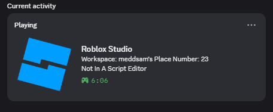
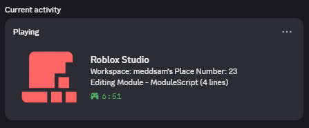
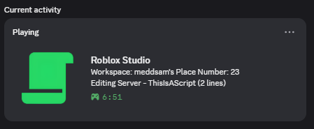
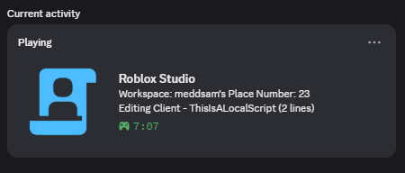
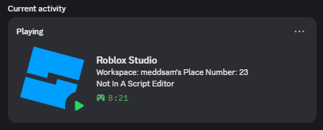
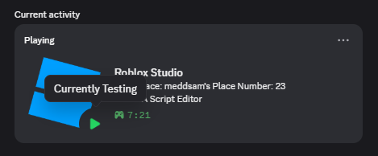

# Froststrap Studio RPC Plugin
A plugin to connect your Studio with Discord  
Heavily inspired by [StudioPresence](https://github.com/iArxic/StudioPresence)

## Features
- Real-time activity tracking in Roblox Studio
- Displays info about what you're doing in Roblox Studio
- (Add more features here)

**Note:** This will require the Froststrap app when it releases.

## Preview

### Script Type Indicators

    
    
    
    

### Activity Status

    
    

